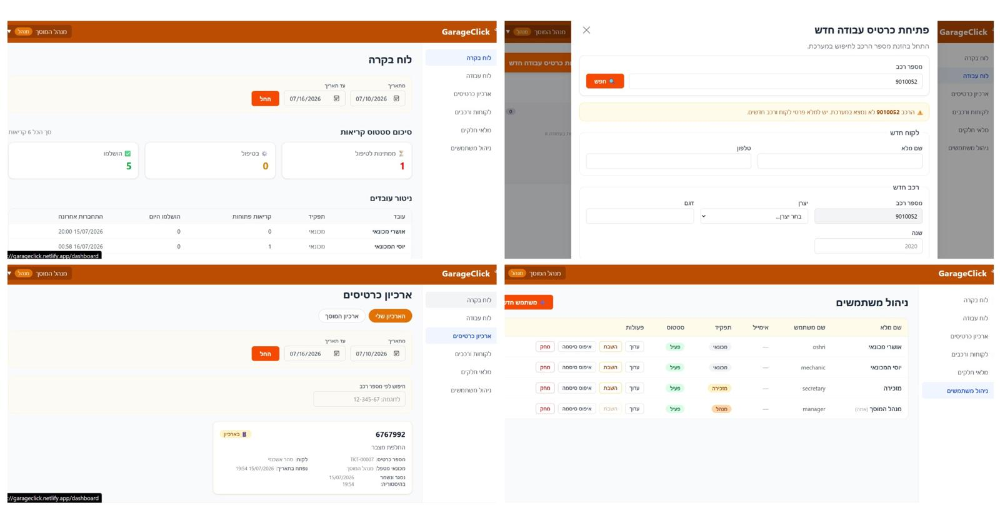

# GarageClick

GarageClick is a modern garage management system designed to replace outdated and cumbersome workflows with a clear, convenient, and more efficient digital interface. The system allows a garage to manage service tickets, customers, vehicles, employees, spare parts inventory, and ticket archives — all in one place, with functionality tailored to the different roles within the garage.

The system includes a Hebrew RTL user interface, designed for the daily work of managers, secretaries, and mechanics. Through the interface, users can create work tickets, track ticket statuses on a work board, select spare parts that are compatible with a vehicle, manage customers and vehicles, update inventory, view a dashboard, and manage users.

---

## Technical Overview

From a technical perspective, the system is divided into three main parts: **Frontend**, **Backend**, and **Database**.

The Frontend was built using **React**, **TypeScript**, **Vite**, and **Tailwind CSS**. On the Frontend side, several key mechanisms were implemented, such as role-based UI behavior, a work board based on ticket status transitions, and reusable components for forms, tables, modals, status badges, error messages, and data filtering.

The Backend was built using **Python** and **FastAPI**, and provides a REST API for all core system operations. On the server side, the system implements mechanisms such as user authentication, role-based authorization, ticket lifecycle management, ticket archiving, user management, and spare-part compatibility logic based on vehicle details and inventory availability.

The data is stored in a relational database that contains the main information of the system: users and roles, customers, vehicles, work tickets, statuses, spare parts, inventory, part-to-vehicle compatibility, archive data, and basic reports.

---

## Project Authors

The project was developed by **Tal Eliya** and **Oshri Zalman** as part of the **"Introduction to Software Engineering"** course during the second year of the **Computer and Software Engineering** degree.

---

## System Preview

